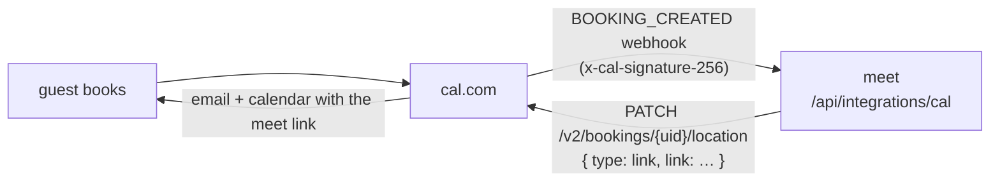

# cal.com integration

Turn a [cal.com](https://cal.com) booking into a Looped Meet room automatically:
when someone books time with you, meet mints a meeting room and writes its link
back onto the booking, so it shows up in cal.com's confirmation email and on the
calendar event — no manual step.

Rooms are keyed off the booking's id, so the link is **stable**: webhook
redeliveries and both halves of a reschedule land on the same room, and the code
survives meet's empty-room garbage collection right up to meeting time (the room
is created on first join, not when the booking is made). Cancelling or rejecting
a booking tears any provisioned room down.

## What you need

- A meet deployment reachable by cal.com over HTTPS.
- A cal.com account (cloud or self-hosted) where you own the event type.

## Setup

### 1. Configure meet

Set these on the **web** service (see [`.env.example`](./.env.example)):

| Variable | Required | Purpose |
| --- | --- | --- |
| `CALCOM_WEBHOOK_SECRET` | yes | Signing secret shared with the cal.com webhook. Enables the endpoint. |
| `CALCOM_API_KEY` | yes for auto write-back | cal.com API key that owns the event type, used to set the booking's location. |
| `CALCOM_API_BASE` | no | API base. Cloud (default) `https://api.cal.com`; self-hosted your API host, e.g. `https://cal.example.com/api`. |

The endpoint stays a `404` until `CALCOM_WEBHOOK_SECRET` is set.

Pick a strong random `CALCOM_WEBHOOK_SECRET` (e.g. `openssl rand -hex 32`).

### 2. Create the API key

In cal.com: **Settings → Developer → API keys → Add**. Create a key owned by the
same user who hosts the bookings (the key must have permission over the event
type). Put it in `CALCOM_API_KEY`.

### 3. Add the webhook

In cal.com: **Settings → Developer → Webhooks → New**.

- **Subscriber URL:** `https://<your-meet-host>/api/integrations/cal`
- **Secret:** the same value as `CALCOM_WEBHOOK_SECRET`
- **Event triggers:** `Booking created`, `Booking rescheduled`, `Booking
  cancelled` (and `Booking rejected` if you use confirmations)

Use cal.com's **Ping test** to confirm delivery — a ping has no booking id and
is safely ignored (`{ "ok": true, "action": "ignored" }`).

## How the link reaches attendees

meet calls `PATCH /v2/bookings/{uid}/location` with a `link`-type location.
cal.com updates the calendar event and sends its own location-change
notification to attendees, so the meet link appears wherever the meeting
location does. This works regardless of the event type's default location — you
don't need to preconfigure a "Cal Video" or custom-link location.

## Notes & troubleshooting

- **Starting the meeting.** A booked room opens like any durable meet link: the
  first person in an empty room starts it from the waiting screen, and later
  arrivals knock to be admitted.
- **No link on the booking.** Check the web logs for `[calcom]` errors. A
  common cause is a missing/underprivileged `CALCOM_API_KEY`; the room link is
  still valid, it just wasn't pushed back to cal.com.
- **401 invalid signature.** The webhook secret in cal.com doesn't match
  `CALCOM_WEBHOOK_SECRET`, or a proxy is altering the request body before it
  reaches meet (the signature is over the raw body).
- **Self-hosted cal.com.** Set `CALCOM_API_BASE` to your API host. The
  location endpoint requires cal.com API version `2024-08-13`, which meet sends
  automatically.
- **Security.** Every delivery is verified with a constant-time HMAC-SHA256
  check over the raw body; unsigned or mis-signed requests are rejected.
